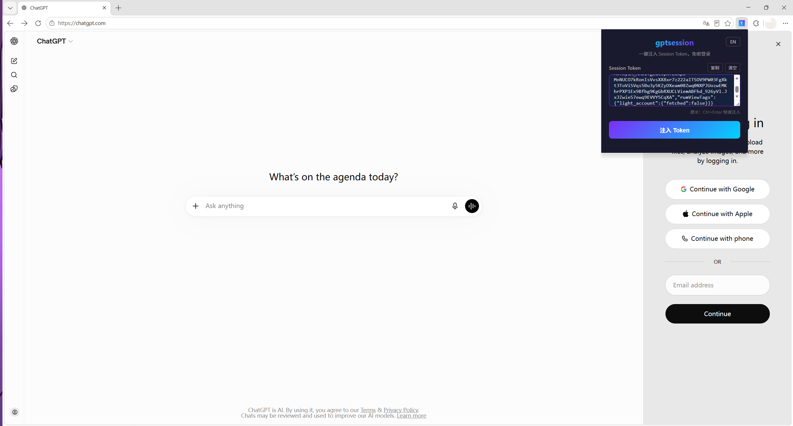
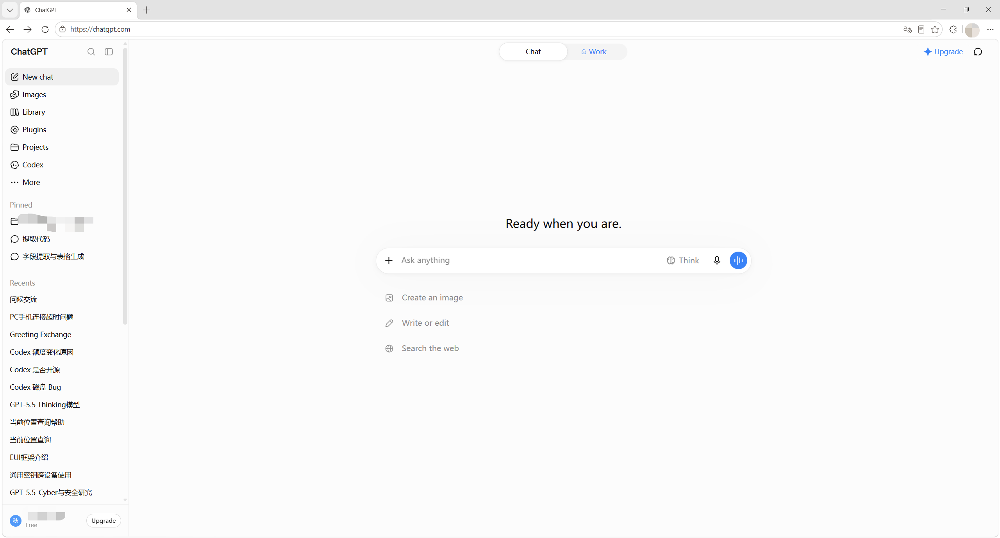

# gptsession


> One-click silent injection of ChatGPT Session Token for passwordless login — a Chrome Extension built with Manifest V3.

Paste or type ChatGPT's `__Secure-next-auth.session-token`, click a button to write it into the browser's cookie store, and the page will automatically reload or redirect to ChatGPT — logging you in without any extra steps. Features clipboard auto-detection, token format validation & cleaning, EN/ZH language toggle, and local account history management.

<p align="center">
  
</p>

---

## ⚠️ Disclaimer (Read First)

This project is **for learning and research purposes only**. It serves as a technical demonstration of the Chrome Extension MV3 Cookie API, and must not be used in any scenario that violates laws, regulations, or third-party terms of service.

- Sharing or transferring ChatGPT accounts using this tool **may violate OpenAI's Terms of Service** and may result in account bans.
- **Commercial use is strictly prohibited**, including but not limited to reselling ChatGPT accounts, bulk registration, black-market account trading, or any other profit-seeking activity.
- **This project does not target OpenAI services per se, nor does it call any OpenAI API. It only demonstrates how a Chrome extension reads and writes cookies for a specified domain.**
- The author **assumes no liability** for any direct or indirect damages arising from the use of this tool, including but not limited to account bans, data loss, or legal risks.
- Users must ensure they have legitimate authorization to use this tool and must comply with local laws and regulations.
- The author is not responsible for any misuse of this tool; all consequences are borne by the user.

### 🚫 Not for Chrome Web Store

This extension is **intended for developer self-use only via "Load unpacked" and will NOT be published to the Chrome Web Store**.

Reasons:
- Chrome Web Store policies explicitly prohibit "account sharing / credential injection" extensions. Submitting it will result in **rejection and possible developer account suspension**.
- The author will not submit or publish this extension to any browser store.
- If any third party repackages this repository and publishes it to a store, the original author is not liable; consequences are borne by that third party.

---

## ✨ Features

- **One-click injection**: Paste token → click button → cookie is written → page reloads / redirects
- **Clipboard auto-detect**: When the popup opens, automatically reads the clipboard and prefills any JWT starting with `eyJ`
- **Smart token cleaning (foolproof)**: Automatically strips `__Secure-next-auth.session-token=` prefix, quotes, whitespace; extracts `sessionToken` from JSON session API responses
- **Token format validation**: Validates JWT format before writing (`eyJ` prefix, multiple base64url segments); rejects invalid tokens
- **Chunked cookie writing**: Automatically splits oversized tokens using next-auth's chunked cookie convention (`.0`, `.1`, ...)
- **Remove-then-write**: Dynamically queries and clears all existing cookies of the same name (including legacy chunks) before writing, avoiding conflicts
- **Account history**: Successfully injected tokens are saved locally (max 10 entries) with a dropdown for quick switching; supports single-entry deletion and **Clear All**
- **Cross-page redirect**: Injecting from any page will automatically redirect to `chatgpt.com`; if no active tab exists, prompts the user to open one manually
- **Keyboard shortcuts**: `Ctrl+Enter` (or `Cmd+Enter` on Mac) for quick injection; **Copy** and **Clear** buttons next to the input field
- **Auto-fading status messages**: Success/info messages fade out after 3 seconds, error messages after 5 seconds
- **Debug log toggle**: A `DEBUG` constant in `src/background.js` enables verbose logging when set to `true`
- **Toolbar badge**: Shows the number of saved accounts on the extension icon
- **Accessibility**: Status messages use `role="alert"` for screen readers; buttons have `aria-label`
- **Timestamped history labels**: Multiple tokens for the same email are distinguishable by timestamp

---

## 📦 Installation

No Chrome Web Store publish needed — install directly in Developer Mode:

1. **Download** — Click the green **Code** button at the top of this repo → **Download ZIP**, then unzip it to a folder on your computer.
2. **Open Extensions page** — In Chrome/Edge, go to `chrome://extensions/` (or `edge://extensions/`).
3. **Enable Developer Mode** — Toggle the **Developer mode** switch in the top-right corner.
4. **Load the extension** — Click **Load unpacked**, navigate to the unzipped folder, and select it (the folder that contains `manifest.json` — **do NOT** select the `src/` subfolder).
5. **Pin the icon** — The extension now appears in your toolbar. Click the puzzle-piece icon 🧩 in the top-right of Chrome, find **gptsession**, and pin it for easy access.

> ✅ Works with Chrome, Edge, Brave, Vivaldi, and other Chromium-based browsers (Manifest V3, Chrome ≥ 110).

---

## 🚀 Usage

1. **Get your token** — Log in to [chatgpt.com](https://chatgpt.com) first, then click the extension icon and press **Open** next to "Get token:" (or visit `https://chatgpt.com/api/auth/session` directly). Copy the `sessionToken` value from the JSON response (a JWT string starting with `eyJ`). You can also copy the **entire JSON response** and paste it directly — the extension auto-extracts `sessionToken`.
2. Click the extension icon in the toolbar to open the popup
   - If the clipboard already contains text starting with `eyJ`, it will be auto-filled
3. Paste the token (or full JSON) into the input field (prefixes, quotes, and formatting are handled automatically)
4. Click **Inject Token** (or press `Ctrl+Enter` while focused in the input field)
5. On success, the page will automatically reload or redirect to ChatGPT, and you will be logged in
6. Next time, select an account directly from the **Account History** dropdown to avoid re-pasting
   - Click **Delete** to remove a single entry; click **Clear All** to wipe all saved tokens (with confirmation)

---

## 📸 Screenshots

| Before Injection — Login Page | After Injection — Logged In |
|---|---|
|  |  |
| Popup open on ChatGPT login screen, token pasted and ready to inject. | One click later — automatically logged in, sidebar and chat history restored. |

---

## 📁 Project Structure

```
gptsession/
├── manifest.json                 # Extension manifest (Manifest V3) — must be at root
├── src/                          # Source files
│   ├── popup.html                # Popup UI
│   ├── popup.css                 # Dark-themed styles
│   ├── popup.js                  # Frontend logic: clipboard, cleaning, history, shortcuts, i18n
│   └── background.js             # Service Worker: cookie read/write, chunking, validation, tab reload
├── icons/                        # Extension icons
│   ├── icon16.png                # 16×16
│   ├── icon48.png                # 48×48
│   └── icon128.png               # 128×128
├── screenshots/                  # Screenshots for README
│   ├── before-injection.png      # Before: popup on login page
│   └── after-injection.png       # After: successfully logged in
├── .github/                      # GitHub templates
│   ├── PULL_REQUEST_TEMPLATE.md
│   └── ISSUE_TEMPLATE/
│       ├── bug_report.md
│       └── feature_request.md
├── package.json                  # npm dev dependencies (ESLint / Prettier)
├── .eslintrc.json                # ESLint configuration
├── .prettierrc.json              # Prettier configuration
├── .prettierignore               # Prettier ignore patterns
├── .gitattributes                # Cross-platform line ending rules
├── .gitignore
├── LICENSE                       # MIT License
└── README.md                     # Project documentation
```

---

## 🔧 Technical Details

### Permissions

| Permission | Purpose |
|---|---|
| `cookies` | Read/write session cookies for `chatgpt.com` |
| `tabs` | Query, reload, or redirect the active tab |
| `storage` | Save account history locally |
| `clipboardRead` | Auto-fill tokens from clipboard |

### Host Permissions (Strictly Scoped)

Only `https://chatgpt.com/*` and `https://*.chatgpt.com/*` are requested. No other sites are accessed.

### Cookie Write Spec

- `name`: `__Secure-next-auth.session-token` (automatically chunked to `.0`, `.1`, ... if oversized)
- `domain`: `.chatgpt.com`
- `path`: `/`
- `secure`: `true`
- `httpOnly`: `true`
- `sameSite`: `lax`
- `expirationDate`: Current timestamp + 365 days

---

## 🔒 Privacy

- This extension **does not collect or upload any user data**
- Tokens and account history are stored **in plaintext** in `chrome.storage.local` (local only); use in trusted environments
- No third-party analytics or tracking SDKs are included
- Uninstalling the extension removes all locally stored data
- The `clipboardRead` permission is used **only once** when the popup opens to auto-fill tokens; it **does not monitor the clipboard in the background**

---

## 🎨 Icon Copyright Notice

The `icons/icon16.png`, `icons/icon48.png`, and `icons/icon128.png` files in this repository are original works created for this project (simple abstract graphics, not any third-party trademark) and are open-sourced under the MIT License along with the code.

**This project does not use the official OpenAI / ChatGPT logo** to avoid trademark infringement. To replace them with your own icons, simply overwrite those three files.

---

## 🛠 Development (Optional)

The project is a static Chrome extension with no build step. If you want to use code style tools:

```bash
# Install dev dependencies (package.json provided)
npm install

# Lint code
npx eslint src/popup.js src/background.js

# Format code
npx prettier --write "src/**/*.{js,css,html}"
```

Configuration is in `.eslintrc.json` and `.prettierrc.json`.

---

## 🧪 Acceptance Tests

See [AGENTS.md](./AGENTS.md) Section 5 for 6 test cases (permissions, clipboard resilience, cleaning, cookie integrity, seamless refresh, cross-page redirect).

---

## 🔐 Security Policy

### Reporting Vulnerabilities

Thank you for caring about the security of this project. If you discover a security vulnerability, please **report it privately**; **do not open a public Issue**.

**Reporting channels:**

- **GitHub Security Advisory (recommended)**: Repository → Security → Advisories → New draft advisory
- **Email**: Contact the repository owner via GitHub private email (enable "Send email" on your GitHub profile)

When reporting, please include as much of the following as possible:

- Affected version(s)
- Steps to reproduce
- Expected vs. actual behavior
- PoC (if applicable, encrypted or redacted)

I will acknowledge receipt within **7 days** and provide a fix plan after assessment.

### By-Design Behaviors (Not Vulnerabilities)

The following behaviors are **intentional design decisions** and are not considered security vulnerabilities. Please **do not report them as Issues**:

1. **Plaintext token storage** — Account history is stored in plaintext in `chrome.storage.local`, an intentional design choice to enable quick account switching. `chrome.storage.local` is only accessible to this extension; other extensions or websites cannot read it. If you do not accept plaintext storage, do not use the "Account History" feature, or click "Clear All" after use.
2. **Clipboard access** — The clipboard is read once when the popup opens, solely to auto-fill tokens starting with `eyJ`. It **does not monitor the clipboard in the background**; the `clipboardRead` permission is explicitly declared in `manifest.json`.
3. **Cookie writing** — The core functionality of this extension is to write session cookies to `chatgpt.com`. This is a user-initiated action; host permissions are strictly scoped to `chatgpt.com` and no other sites are accessed.

### Disclaimer of Liability

- This project is provided "AS IS" under the MIT License without warranty of any kind.
- Users are solely responsible for any consequences arising from the by-design behaviors described above (plaintext storage, clipboard access, cookie writing).
- The author assumes no liability for account bans, data loss, legal risks, or other damages resulting from misuse of this tool (see Disclaimer above).

---

## 🤝 Contributing

Thank you for your interest in contributing to gptsession! Please read the following guidelines before contributing.

### 🚫 Core Rules (Violations Will Be Closed Immediately)

#### 1. No Real Tokens in Any Submission

Real account tokens (strings starting with `eyJ`) are **strictly prohibited** in any of the following:

- PR code, comments, or commit messages
- Issue descriptions, screenshots, or logs
- Test cases or sample data

If you need to demonstrate token format in code, use an **obvious placeholder**:

```javascript
// ✅ Correct: use a clear placeholder
const sampleToken = "eyJFAKE.xxx.yyy-FOR-TEST-ONLY-DO-NOT-USE";

// ❌ Wrong: pasting a real token (even an expired one)
const sampleToken = "eyJhbGciOi...<real JWT>...";
```

Consequences of violation:

- PR → closed immediately; author is asked to **rewrite history** (`git rebase` / force push) to remove the leak
- Issue → closed and deleted immediately

#### 2. No Debug Artifacts in PRs

Please ensure PRs **do not include** the following files (already in `.gitignore`; do not force-add with `git add -f`):

- `*.token` / `token-*.txt` / `my-token*.txt`
- `cookies.json` / `chatgpt-session*.json` / `dump-*.json`
- `node_modules/` / `dist/` / `*.zip`

### 🛠 Development Workflow

```bash
git clone https://github.com/Drikesuy/gptsession.git
cd gptsession
npm install   # Install ESLint / Prettier (optional)
```

**Code style:**

- Run `npm run lint` before committing to ensure no ESLint errors
- Run `npm run format` to unify code style (Prettier)
- JavaScript uses double quotes, semicolons, and 2-space indentation (configured in `.eslintrc.json` / `.prettierrc.json`)

**Commit convention (Conventional Commits):**

```
<type>(<scope>): <subject>

feat:     New feature
fix:      Bug fix
docs:     Documentation changes
style:    Code formatting (no functional change)
refactor: Refactoring (neither feat nor fix)
chore:    Build / tooling changes
```

Examples:

```
feat(popup): support extracting sessionToken from JSON responses
fix(background): fix chunked writing failure for oversized tokens
docs: strengthen README disclaimer
```

### 🧪 Testing

This project has no automated tests. Before submitting a PR, please **manually verify** the 6 acceptance tests listed in [AGENTS.md](./AGENTS.md) Section 5:

- [ ] Permissions are minimal (no unnecessary domain warnings)
- [ ] Clipboard resilience (works with or without clipboard content, no errors)
- [ ] Token cleaning (prefixes, quotes, JSON are handled correctly)
- [ ] Cookie integrity (Secure=true, expiration = 1 year from now)
- [ ] Seamless refresh (reloads chatgpt.com and logs in)
- [ ] Cross-page redirect (redirects non-ChatGPT pages to chatgpt.com)

### 📝 PR Process

1. Fork this repository
2. Create a branch: `git checkout -b feat/your-feature`
3. Commit your changes (following the commit convention above)
4. Push: `git push origin feat/your-feature`
5. Open a PR on GitHub with a clear description (see [.github/PULL_REQUEST_TEMPLATE.md](./.github/PULL_REQUEST_TEMPLATE.md))

Prefix PR titles with a type, e.g., `feat:` / `fix:` / `docs:`.

### 🤔 Project Scope

This project will **not** accept the following features (PRs will be rejected):

- Publishing to the Chrome Web Store (violates policy)
- Automated bulk registration / multi-account auto-login
- Bypassing OpenAI risk controls, CAPTCHAs, or device fingerprinting
- Any feature related to black-market activities or commercial account resale

Welcomed contributions:

- Code quality improvements and bug fixes
- Compatibility enhancements (more Chromium-based browsers)
- Accessibility and internationalization (i18n)
- Better UI / UX (maintaining dark theme consistency)

### 💬 Communication

- Bugs / feature requests → Issues (use templates)
- Security vulnerabilities → Private disclosure (see Security Policy above)
- Other discussions → GitHub Discussions (or open an Issue if Discussions is not enabled)

---

## 📄 License

[MIT License](./LICENSE) © 2026 Drikesuy
